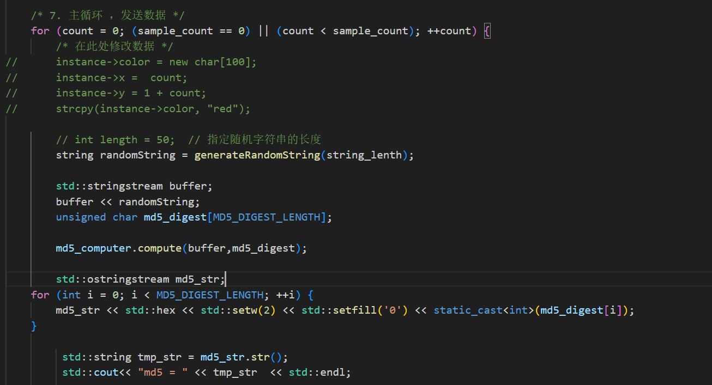
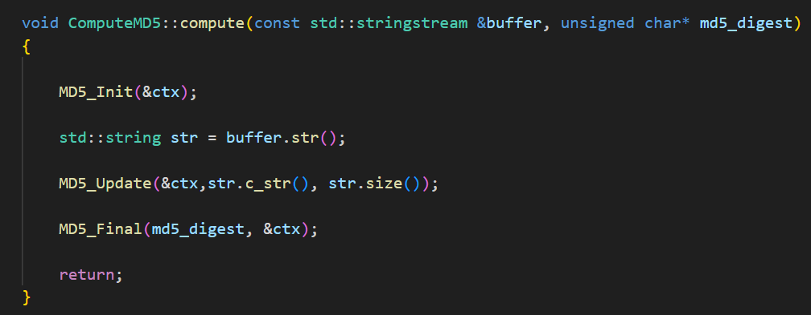
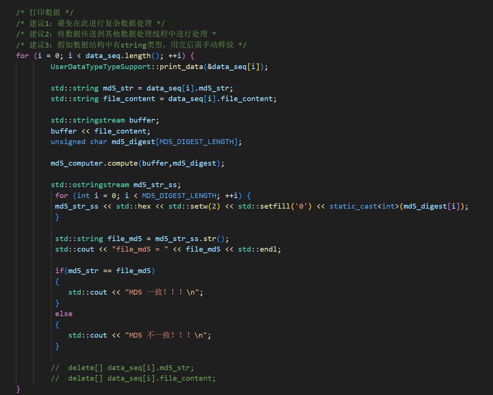
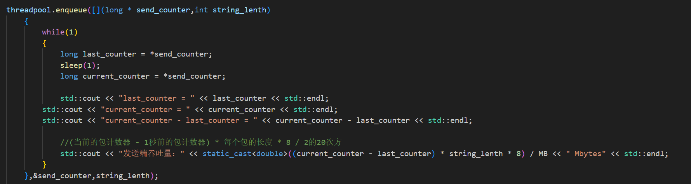
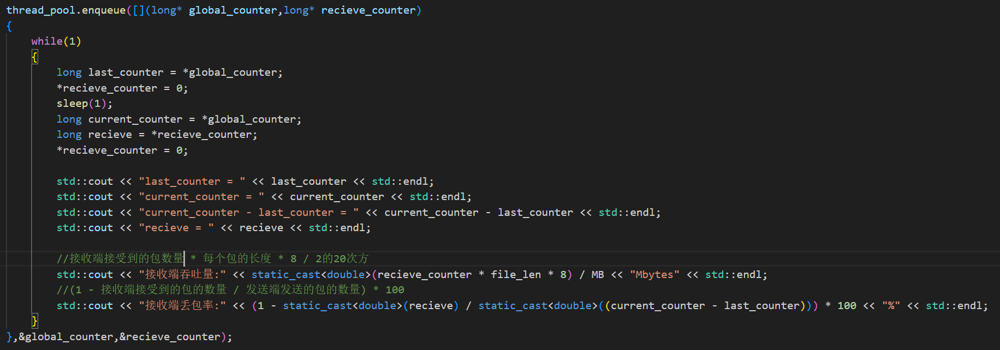
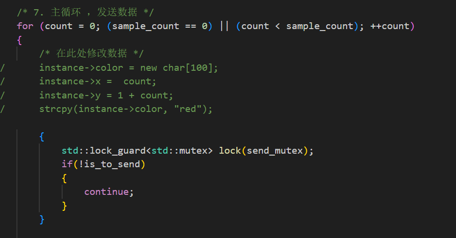
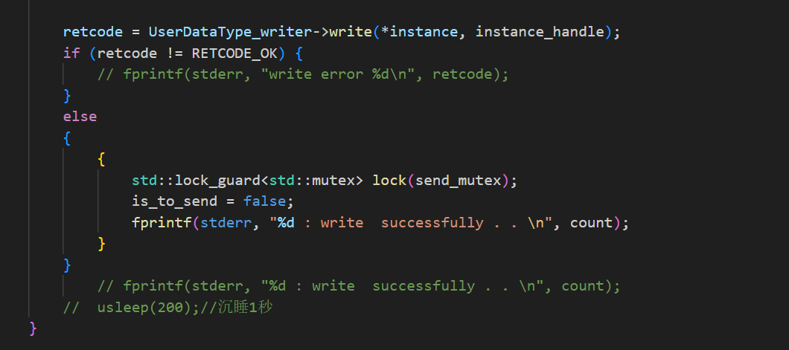
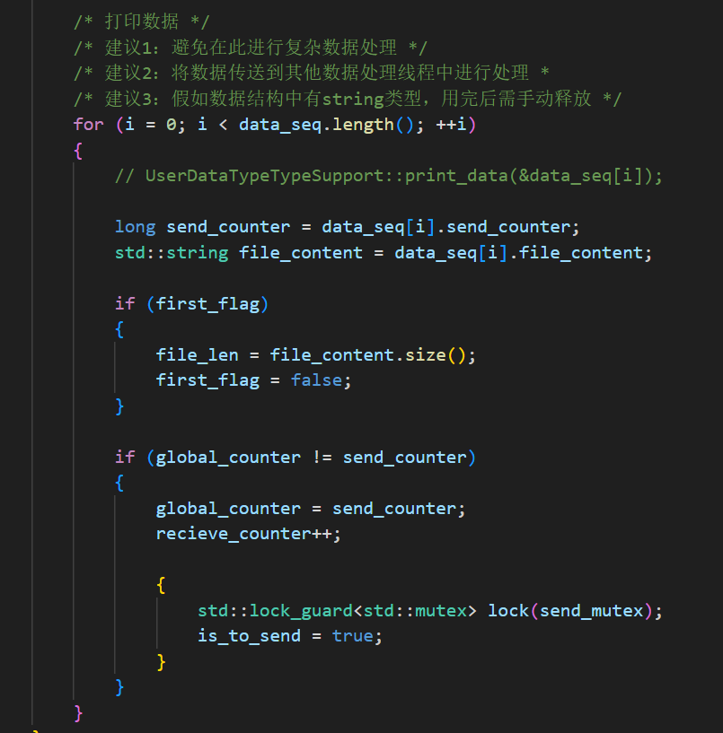
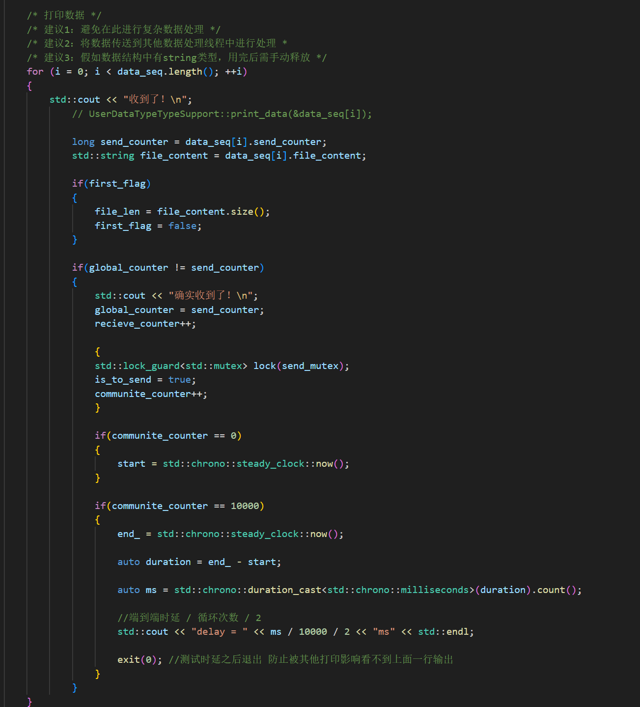

# uDDS测试用例代码说明

## 第一题

Pub通过命令行参数（第一个）可以制定发送的文件大小（单位B）。

编译需要使用openSSL。

发送端在发送之前会将要发送的数据送到一个计算md5的对象中进行计算，并且把md5值写入到发送的对象中发送到接收端，接收端在接受到对象之后回将接受到的数据也送进计算Md5的对象中计算md5值，并与发送端发送的md5进行比较，当这两项完全一致的时候认为md5值相同。

### 发送端：

生成一个随机字符串，然后计算md5值，md5计算方式如下所示：

接受端：

## 第二题

发送端持续发送数据，接收端持续接收数据。

在发送端和接收端各自有一个统计线程。

### 发送端：

该线程先获取一下当前发送的包的包号，休眠一秒后获取当前发送的包号。

使用（当前包号 - 1秒前的包号） * 发送的数据长度 * 8 / 2的20次方 获取发送端的吞吐量（单位Mbytes)。

### 接收端

该线程先获取当前的包号，并将这段时间接受到的包计数器置为0,。休眠一秒后，再获取当前的包号，再获取一下这段时间接收到的包的数量。

接收端吞吐量：接收端接受到的包数量 * 每个包的长度 * 8 / 2的20次方 获取接受端的吞吐量（单位Mbytes）。

丢包率：(1 - 接收端接受到的包的数量 / 发送端发送的包的数量) * 100 （单位 百分制）

## 第三题

发送端和接收端都需要发送和接受数据，于是各自再开一个线程来做发送\接受。

发送端：

is_to_send是一个符号位，初值为true，代表初始的时候应该是发送一条消息。

在发送成功之后，将is_to_send置为false，让发送线程不再持续放松。

接受线程在接受到来自接收端的数据之后再把is_to_send置为true，让发送线程继续发送下一个数据包。

接受端：

同步流程基本与上述相同。

区别在于在接受端判断收到新包之后，会存储第一次收到的时间与第10000次收到的时间。

时延计算：(第10000次接受到的时间 - 第一次接受到的时间)  / 10000 /2 （单位 ms）。

